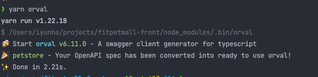
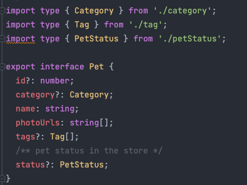
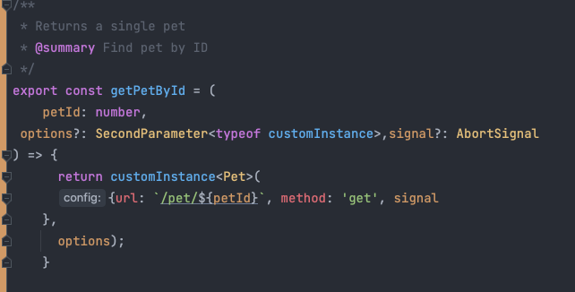
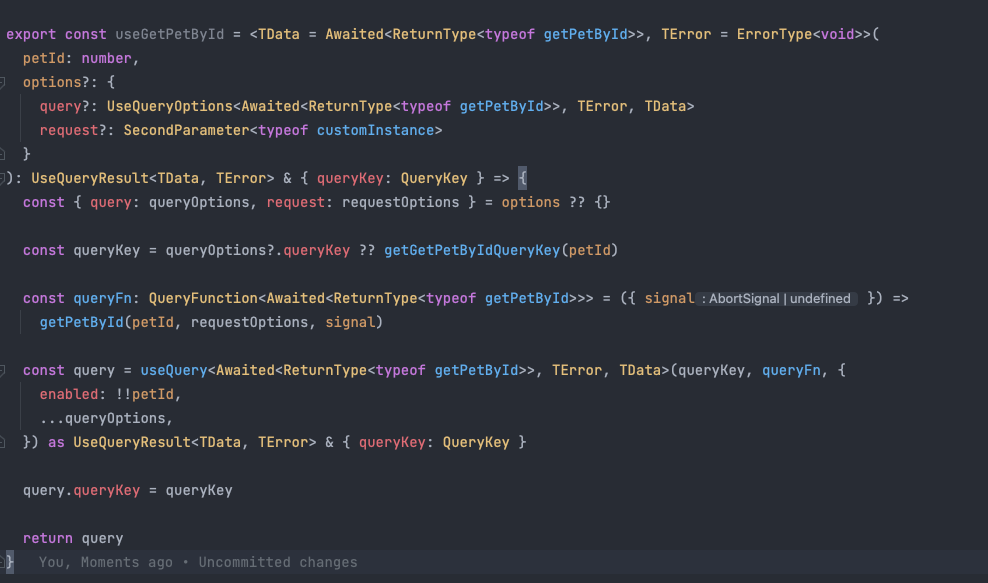
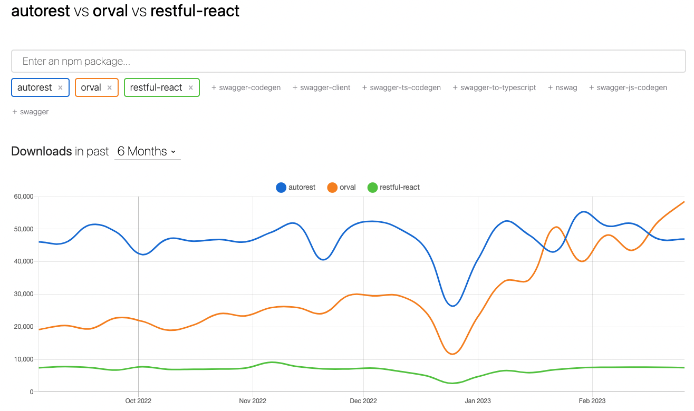

# # React Orval 도입으로 API 호출 복잡도 최소화

## Orval이란 ?

Orval은 OpenAPI(Swagger) 스펙을 기반으로 자동으로 Restful API 호출 코드를 생성합니다.   
이를 통해 프론트엔드 개발자는 API 호출을 위한 수많은 boilerplate 코드를 작성할 필요 없이 쉽게 API 호출을 수행할 수 있습니다. Orval은 Swagger 스펙 변경 사항에 대응하는 업데이트를 자동으로 수행합니다. Swagger 스펙 변경으로 인한 API 호출 코드 수정에 필요한 시간과 노력을 줄일 수 있습니다.

## 왜 Orval을 도입하였는가?

OpenAPI(Swagger)에 명세된 백엔드 API 기준으로 타입스크립트의 타입뿐만 아니라 Axios API 호출 메서드, 원하는 React 라이브러리의 Hooks를 자동으로 생성해줍니다. 예를 들면, Orval에는 React-Query를 지원하는 데, React-Query Hook을 Code Generate를 통해 전부 생성할 수 있습니다.  

Orval은 React-Query, Svelte-Query, Vue-Query, Angular, SWR 까지 다양한 라이브러리 Hooks을 제공합니다. 이는 일반적인 Swagger Client (code Gen) 라이브러리와는 차별점이 있다고 생각합니다.

## Orval(React-Query Hooks) 적용

### 1. 설치 방법

```jsx
// npm, yarn 사용 환경에 따라 설치
npm i -g orval 혹은 yarn global add orval
```

### 2. orval.config 작성

프로젝트 Root 경로에 orval.config.ts를 생성해주고 아래와 같이 작성합니다.  
orval.config 는 [input]과 [output]으로 나누어 보면 쉽습니다.  
[input]은 target에 백엔드의 swagger 주소(json 경로) 혹은 yaml 파일을 넣어줍니다.  
[output]은 input에 대한 Generate 될 Hooks와 types에 대해 설정하도록 합니다.  

```jsx
// orval.config.ts
module.exports = {
   petstore: {
		 input: {
       // 📌 스웨거 주소 혹은 yaml
			 target: 'https://petstore.swagger.io/v2/swagger.json',
       // target: './petstore.yaml', 
     },
     output: {
       mode: 'split',
       target: 'src/generated/hooks.ts',
       schemas: 'src/generated/types',
       client: 'react-query',
		   override: {
		        mutator: {
		          path: './src/plugins/custom-instance.ts',
		          name: 'customInstance',
		        },
		        useDates: false,
		        query: {
		          useQuery: true,
		          useInfinite: true,
		          useInfiniteQueryParam: 'page',
		        },
		      },    
       },
    },
 };
```

### 3. custom-instance 작성

CodeGen을 통해 생성 될 Axios API 호출 메서드에 사용 될 Axios Instance를 직접 작성할 수 있습니다.  

여기서 유저 인증/인가에 필요한 Token을 헤더부분에 집어 넣을 수 있습니다.  

```jsx
import Axios, { AxiosError, AxiosRequestConfig } from 'axios';

export const AXIOS_INSTANCE = Axios.create({ baseURL: '' });

export const customInstance = <T>(config: AxiosRequestConfig): Promise<T> => {
  const source = Axios.CancelToken.source();
  const promise = AXIOS_INSTANCE({ ...config, cancelToken: source.token }).then(
    ({ data }) => data,
  );

  ~~// @ts-ignore~~
  promise.cancel = () => {
    source.cancel('Query was cancelled by Vue Query');
  };

  return promise;
};

export default customInstance;

export interface ErrorType<Error> extends AxiosError<Error> {}
```

### 4. Orval 실행

터미널에서 아래와 같이 실행하면, Root 경로의 orval.config를 찾아 작성한 대로 codeGen을 실행합니다.  

```jsx
// npm, yarn 사용 환경에 따라 실행
npm run orval 혹은 yarn orval
```



### 5. 실행 결과 확인

```jsx
// Orval Gen을 통해 생성된 파일 
/src
 /generated
  /types
   *type.ts
  hooks.ts 
```







## 다른 Code Generator 라이브러리와 비교해본다면 ?



Orval과 비슷한 역할을 하는 OpenAPI Code Generator 라이브러리들의 최근 6개월 간 다운로드 수를 [비교](https://npmtrends.com/autorest-vs-orval-vs-restful-react)해보았습니다. 최근 Orval이 다른 라이브러리에 비해 다운로드 수가 증가하는 모습을 볼 수 있으며, 비교적으로 Orval이 다른 라이브러리에 비해 공식 문서가 읽기 쉬우며, React를 많이 사용하는 요즘, React-Query를 지원 Orval이 프론트엔드 최근 동향에 맞다고 생각이 들었습니다.

Orval과 같이 API 호출 코드를 백엔드 OpenAPI (Swagger) 문서에 너무 의존성을 두는 일이라서 염두가 된다면,  [Openapi-typescript-codegen](https://www.npmjs.com/package/openapi-typescript-codegen) 라이브러리를 추천합니다. Swagger에 명시된 API의 response 스키마의 타입을 Typescript 타입으로 가져와 사용할 수 있습니다.  

[reference - OpenAPI 문서에서 TypeScript 타입 만들기](https://medium.com/humanscape-tech/openapi-%EB%AC%B8%EC%84%9C%EC%97%90%EC%84%9C-typescript-%ED%83%80%EC%9E%85-%EB%A7%8C%EB%93%A4%EA%B8%B0-76084d10934e)
